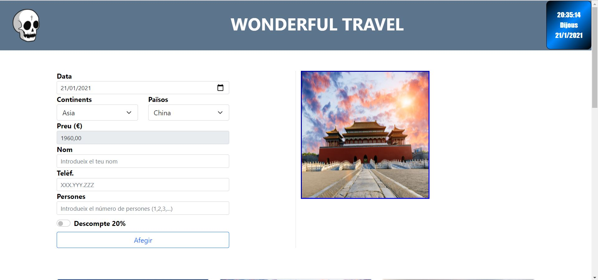
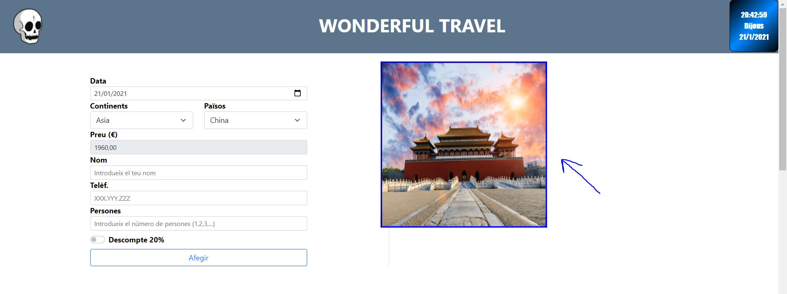
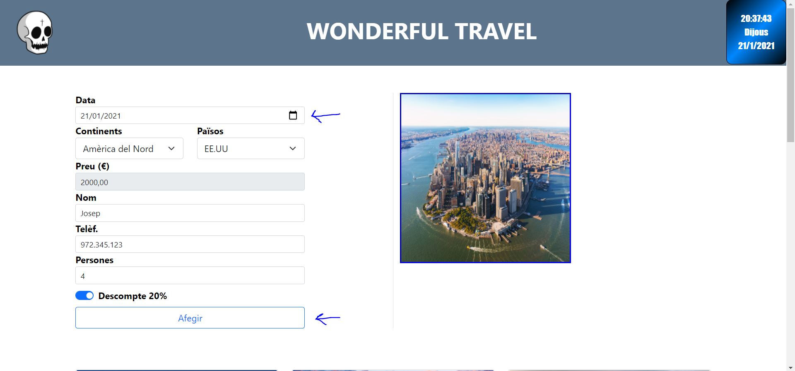
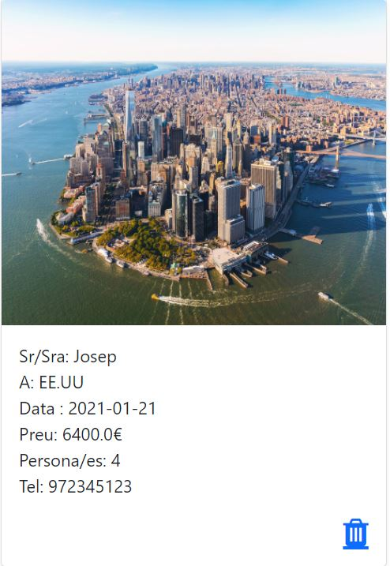
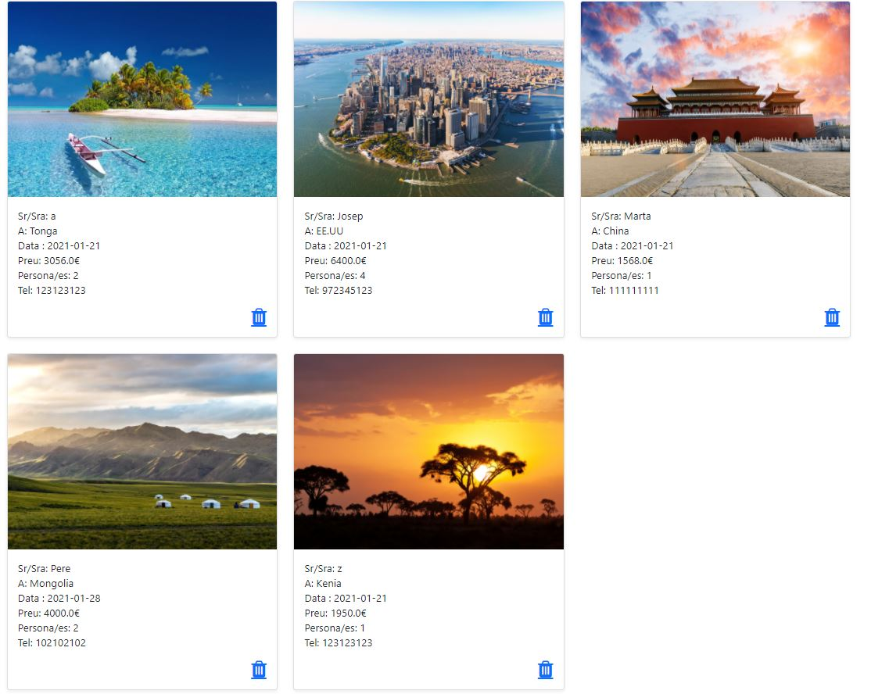
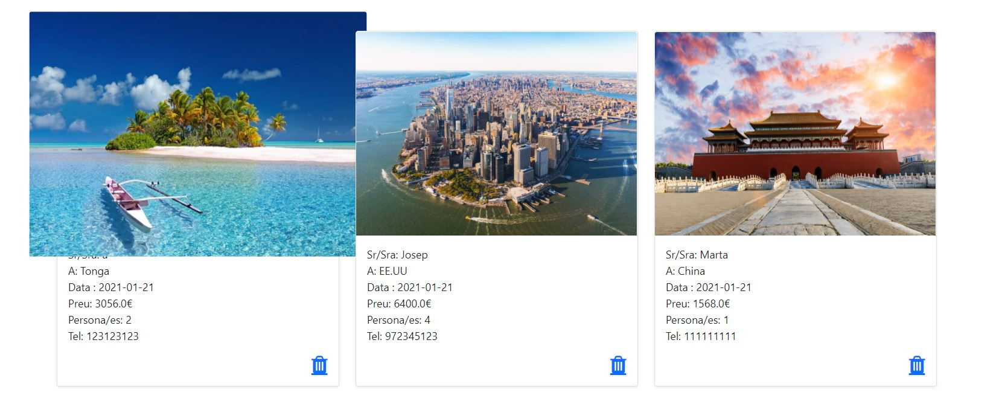
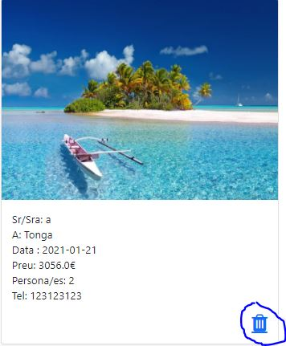

# Projecte 2 Wonderful Travel per Agustín Lara i Bernat Pellicer

Aquest projecte consisteix a crear una web de viatges utilitzant la metodologia MVC de JAVA i el llenguatge Javascript per a la part de frontEND. En el nostre cas també hem fet servir Bootstrap per a una millor presentació.

El projecte consta d'un petit manual d'usuari que ensenya les funcionalitats de la web.

## Manual d'usuari

Una vegada baixat el projecte i executat amb Eclipse, ens trobem amb la pàgina principal:

Com es pot observar, la pàgina web conté una capçalera amb un logotip a la part esquerra superior i un rellotge que marca l'hora, dia de la setmana i data actual.
També es veu un petit formulari amb els inputs buits menys el de la destinació, que hem cregut convenient deixar-lo per defecte amb un païs, ja que sinó quedaria massa senzill i així crida més el disseny a l'hora d'entrar a la web.

Si passes el ratolí per sobre la imatge del país, aquesta s'amplia (De forma raonable, tampoc volem que tapi la pantalla sencera):

Ara el que es pot fer és afegir una reserva. Per a fer això, omplim els inputs del Nom, Persones, Telèfon i, si volem, cliquem al descompte.

Una vegada clicat el botó d'afegir, veurem que a la part de sota apareix la nostra reserva en una "carta", la qual forma part dels estils de Bootstrap. A dins de la carta podem veure la imatge del destí, el nom, el nom de la persona que fa la reserva, el preu total (amb descompte o sense), la data de la reserva, el número de telèfon i una icona d'una paperera.

  

Si afegim més reserves, es veuran a la part inferior del formulari de la següent manera (Ordenades alfabèticament pel nom):

Si passem el ratolí per a sobre les imatges de les reserves, veurem com aquestes també s'amplien.

No queda gaire bé, però era el que es demanava. 

Per últim, podem esborrar una reserva clicant a la icona de la paperera d'una carta.

  

Si l'esborrem, després ja no apareix a la llista de reserves.
